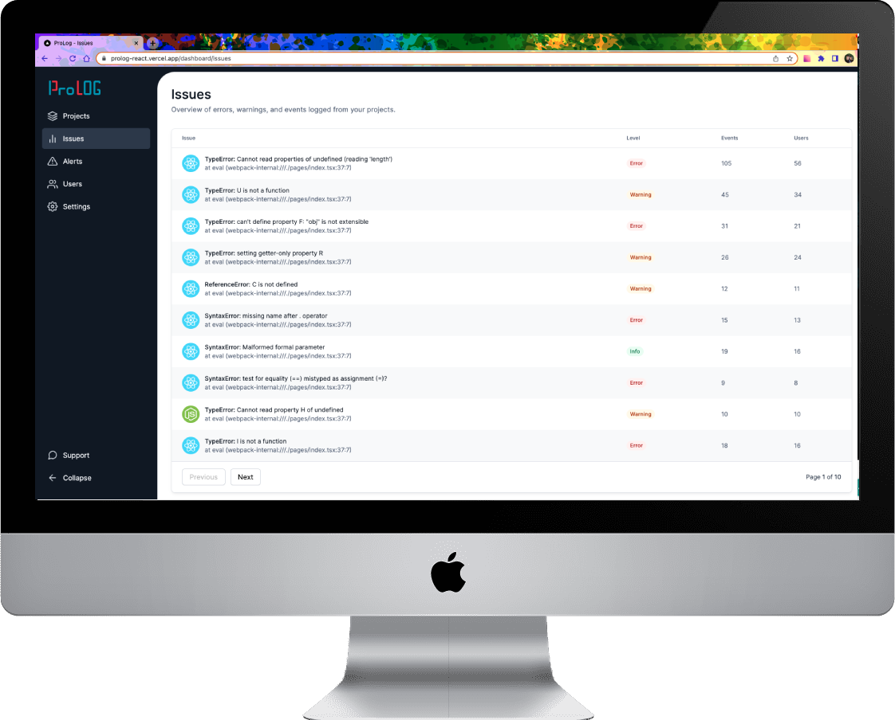

# ProLog

> Error tracking tool that built on codebase during the [React Job Simulator Program](https://profy.dev/).

## Overview

- **How did I build it?** ProLog is the error tracking tool that was built on codebase during the [React Job Simulator Program](https://profy.dev/). I participated in the program to simulate a professional work environment. Moreover, I chose this project since an error tracking tool is used in a lot of serious software products.

- **What was the most challenging part?** The most challenging part was writing Cypress code for an email check which was part of the project tasks. The existing code was a Button component that is not applicable to `href` attribute. I had to figure out how to write code logic in order to check if send email function is working fine.

- **How did I solve it?** I changed the button component to `Link` component first. After that, I could use the `href` attribute and implemented an email sending function. Eventually, I was able to write regular Cypress test code logic to check if the element has the right attribute for sending an email.

- **What was the most fun part?** The most fun part was learning the Cypress. Cypress is a testing framework that requires code logic for testing purposes. I had fun playing around with a new syntax while coming up with different code logic for testing. Especially, I liked the user experience of Cypress, which provides browser developer tools like UI. It is very intuitive and beginner-friendly that lets me get used to it shortly. I definitely want to take advantage of this wonderful testing framework for my next project again.

- **What did I learn?** I learned quite a bit of new technologies including Cypress, Styled Components, Storybook, GitHub Actions for Continuous Integration, and more. I learned the reason why people use testing frameworks like Cypress. It helps developers to identify easier which code logic is breaking the core functions. I realized the benefit of using Styled Components as well. It was more convenient to identify which component has which style since everything is in one file. I noticed good parts of using Storybook that lets developers visualize UI components. By doing so, developers can utilize UI components without being bothered by complex code logics. It is more useful when the developer team collaborates with the designer team since they can interact easier with Storybook. I learned how to take advantage of GitHub Actions for Continuous Integration. CI is the practice of frequently merging branches/PRs into the main branch. Having things like linter, type checks and automated tests running in a pipeline is a prerequisite for practicing Continuous Integration. I realized that CI makes software development easier, faster, and less risky for developers.

- **What will I do differently next time?** If I were to build this kind of project next time again, I want to develop a similar project from scratch on my own. I learned a lot from this program while I was working on the large professional codebase. With the skills I gained from this program, I'm ready to build a complex app that is a real world-like project.

## Technical Decision

- I used the Chrome extension to build a pixel-perfect app: [Screenshot of example](https://drive.google.com/file/d/1V_wImhnv64S4_ImhFqRWkt5yoZfD3jhi/view?usp=share_link)
- I built this app based on Figma designs: [Screenshot of designs](https://drive.google.com/file/d/1jyJL0gDE5DfPBqrIsIhIubd7qItLyAan/view?usp=share_link)
- I worked with tasks on a Kanban board: [Screenshot of tasks](https://drive.google.com/file/d/1Fu3ZetCPHR_GE17qf0hz2myJHPJEgT-9/view?usp=share_link)
- I used feature branches and Pull Requests: [Example PR](https://github.com/profydev/prolog-app-bellhwi/pull/1)

## Features

- 📄 Project list: [Example code](https://github.com/profydev/prolog-app-bellhwi/blob/main/features/projects/components/project-list/project-list.tsx#L70-L111)
- 📫 REST API interaction: [Example code](https://github.com/profydev/prolog-app-bellhwi/blob/main/api/issues.ts)
- 📋 Issue list table : [Example code](https://github.com/profydev/prolog-app-bellhwi/blob/main/features/issues/components/issue-list/issue-list.tsx#L89-L184)
- 🔬 Test with Cypress: [Example code](https://github.com/profydev/prolog-app-bellhwi/blob/main/cypress/e2e/issue-list.cy.ts)
- 📱 Ui kit: [Example code](https://github.com/profydev/prolog-app-bellhwi/blob/main/features/ui/button/button.stories.tsx)

## Tech

      
      
    
      
        
          
          
  
  
  

